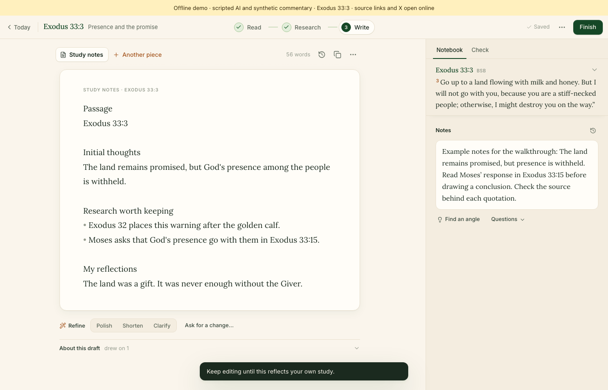

# Personal Commentary

Every passage of Scripture carries two thousand years of context. Personal Commentary gathers it (history, cross-references, the original Hebrew and Greek, and historical commentary) and sets it beside your own notes, so you can build a private commentary one passage at a time.



*The offline demo, with synthetic notes and scripted AI responses.*

A study has three steps, **Read → Research → Write**, and your notebook stays beside each one. When you're done, the study becomes notes, a journal entry, a devotional, or a post for X.

It's a Mac app that runs on your machine. Studies are stored locally in SQLite; research, drafting, and review use the OpenAI API.

## Try it without an API key

```sh
npm ci
npm run demo
```

Open the URL it prints. The demo loads Exodus 33:3 with synthetic commentary and scripted AI responses, so research and drafting need no API key and no dataset download, and nothing leaves your machine unless you open a source link or X. It covers one passage and leaves out the larger lexical and Church Fathers datasets. A banner marks it as a demo, and its temporary data is deleted when you press Ctrl-C.

A good path through it: **Start research**, open the evidence behind a quotation, then **Write → Study notes → Create a first draft**. The real research, verification, and drafting code runs; only the model responses are scripted.

`npm run demo:check` runs the same walkthrough as an automated smoke test.

## How it works

- **Quotations are checked against their sources, not taken on the model's word.** The model cites stored sources, and a deterministic verifier then matches each quoted phrase against the full source text. A quotation it can't find becomes a paraphrase, and the evidence drawer shows every match in context. See [verify.ts](server/verify.ts), [text.ts](shared/text.ts), and [EvidenceDrawer.tsx](web/src/components/EvidenceDrawer.tsx).
- **Research and personal writing travel separately.** Research on a passage sees only the passage, its sources, and a fixed editorial profile, so it can be reused. Your notes, past writing, and preferences go only to drafting. See [research-profile.ts](server/research-profile.ts), [writing.ts](server/writing.ts), and the [boundary tests](tests/unit/research-boundary.test.ts).
- **Review is tied to the exact words you share.** Automated checks and an optional AI review raise findings you resolve before sharing. Approval is bound to a hash of the text, so any edit calls for a fresh review. You post from X's own composer. See [review.ts](server/review.ts), [publish.ts](server/publish.ts), and the [end-to-end scenario](tests/integration/daily-loop.test.ts).

A match proves the wording is in the source. Whether a reading is fair is still yours to judge.

## Run it with your own key

Requires macOS, Node.js 24 or later, and an OpenAI API key for the AI features.

```sh
npm ci
npm run build
npm start
```

Open the address the server prints (usually `http://127.0.0.1:8790`). The first run downloads the reference library and offers to store your API key in the macOS Keychain. Reading and notes work without a key.

For a native window, `npm run mac-app` builds **Personal Commentary.app** into `~/Applications` (Xcode Command Line Tools required). The app runs from this checkout, so rebuild it after moving the folder or changing Node. This is a source project, not a signed release.

## Tests

```sh
npm run typecheck
npm test
npm run build
```

Unit tests cover quotation matching, reference parsing, autosave, revision history, research privacy boundaries, export approval, writing formats, and character limits. Tests run against a temporary data folder, never your own studies.

A fuller end-to-end scenario covers research and writing, fabricated quotations, publishing gates, budget caps, and restart recovery. It runs when you point it at downloaded datasets:

```sh
COMMENTARY_DATASET_DIR="/path/to/downloaded/datasets" npm test
```

It replays recorded model responses and source pages, so it tests the app's behavior, not live model quality. [Fixture notes](tests/fixtures/README.md) explain where the test data comes from.

## Privacy

Studies, revision history, cached sources, and backups stay in your local application-data folder, and readable copies of finished studies are saved to `~/Documents/Personal Commentary/`. The server listens only on your machine and requires a per-process token for any change. Your API key stays in the Keychain.

The AI features do send text to OpenAI: the passage and evidence for research, and your notes and preferences when drafting and reviewing. Response storage is turned off on those requests, but the processing happens in the cloud. Reading sources and downloading datasets also use the network. The app doesn't encrypt its local files.

For more, see the [architecture](docs/ARCHITECTURE.md) and the [design notes](docs/DESIGN.md).

## Sources

The reference library uses the public-domain [Berean Standard Bible](https://berean.bible), [STEPBible data](https://github.com/STEPBible/STEPBible-Data), [OpenBible.info cross-references](https://www.openbible.info/labs/cross-references/), and the [Historical Christian Faith commentaries database](https://github.com/HistoricalChristianFaith/Commentaries-Database), each under its own terms. Commentary from websites is fetched for personal study only; a verified quotation isn't permission to republish its source.
